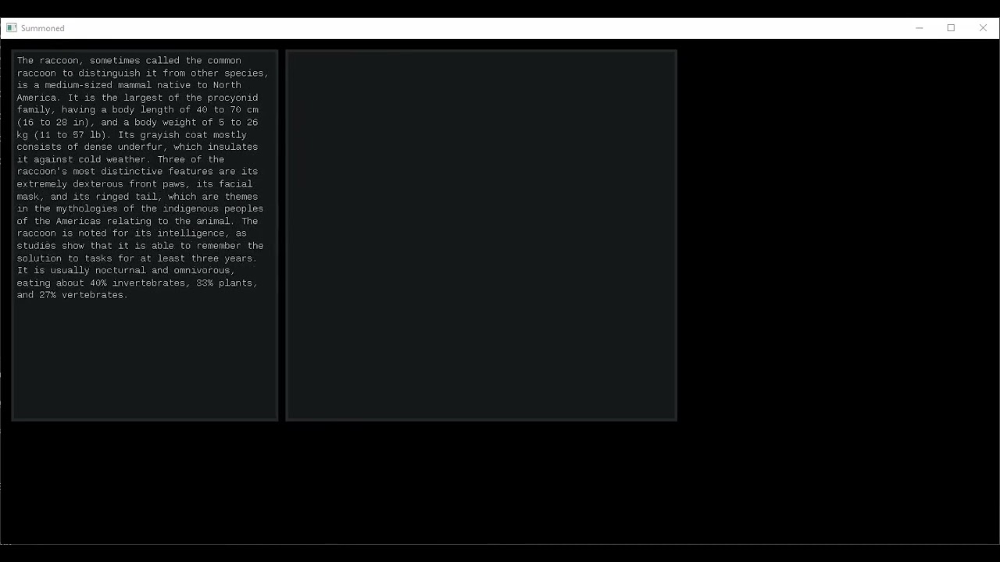

# Software Renderer
Software renderer made entirely from scratch. It uses Windows GDI to acquire font bitmaps that are then rendered by the application. It also has basic string functionality like word wrapping or splitting. The whole app is loaded as a DLL, which allows the program to be recompiled on runtime.

## Demo:

Note: Click the image to be redirected to YouTube